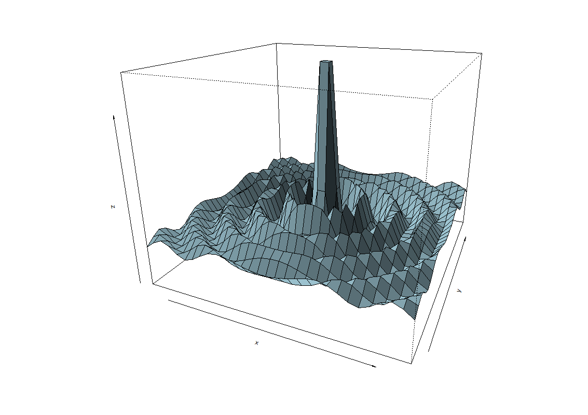
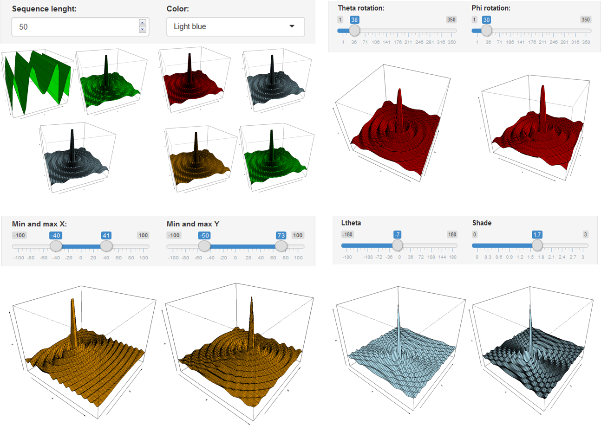

3d plot - persp function
========================================================
author: Ronald Rodriguez
date: 6 de Octubre  2017
autosize: true

3d plot - Briefing
========================================================

***
This is a shiny app to show a 3d plot made with the persp 
funtion. The mathematical function used to create this plot 
was: $$10sin\frac{sqrt(x^2+y^2))}{sqrt(x^2+y^2))}$$ 
In order to change the features such as number of sequence length of polygons 
rendered, x and y values among others. This kind of graphic 
can be useful for surface analysis or hyperplane of solutions analysis.

For more details on persp function please visit: <https://stat.ethz.ch/R-manual/R-devel/library/graphics/html/persp.html>.

Main features
========================================================


***
As app's main features you can vary the values of the 
following parameters:

- Sequence lenght
- Color
- Spatial rotation (Theta and Phi rotation)
- X and Y intervals
- Light and shade values


3d plot code example.
========================================================

Here is a sample code about how you can create a 3d plot


```r
    x <- seq(-25,25, length= 30)
    y <- seq(-25,25, length= 30)
    f <- function(x, y) { r <- sqrt(x^2+y^2); 10 * sin(r)/r }
    z <- outer(x, y, f)
    z[is.na(z)] <- 1
    op <- par(bg = "white")
    persp(x, y, z, theta = 24, phi = 20, 
          expand = 0.8,ltheta = -120, 
          shade = 0.2, col = "lightblue")
```

How to run.
========================================================

You can run this app by entering the url:

https://raxondatascientist.shinyapps.io/RshinyWeek4/

Or you can run it localy by typing the next lines on Rstudio's console.
Be sure to install an updated version of Rstudio and the 
shiny package as well.

```
shiny::runGitHub("ronaldraxon/RshinyWeek4")
```
The repository with the entire code can be foun here: <https://github.com/ronaldraxon/RshinyWeek4>.

